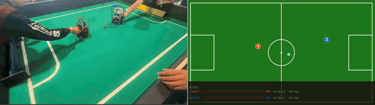
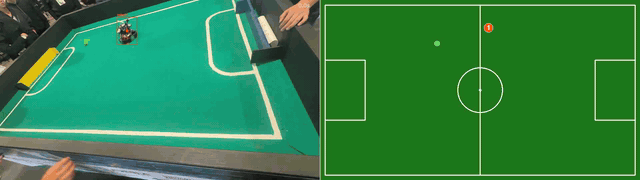
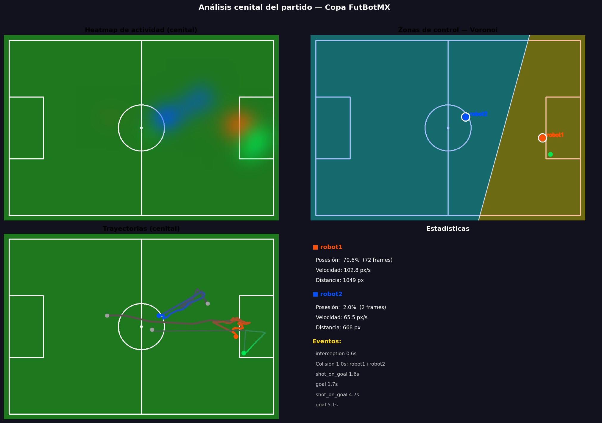
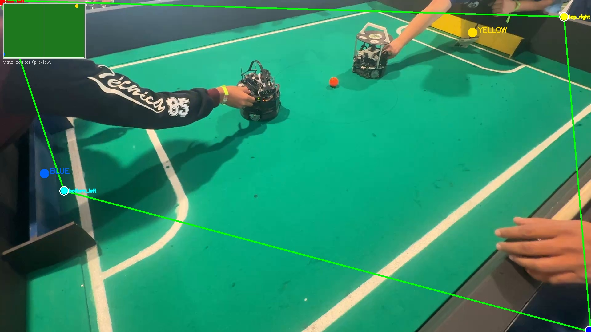
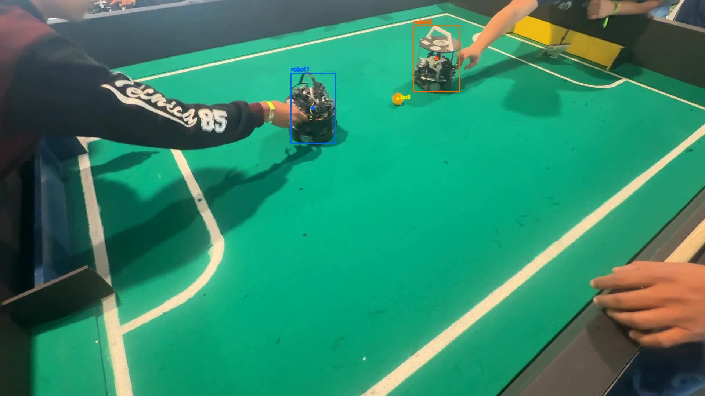
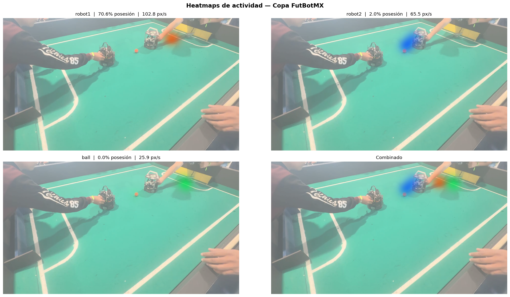
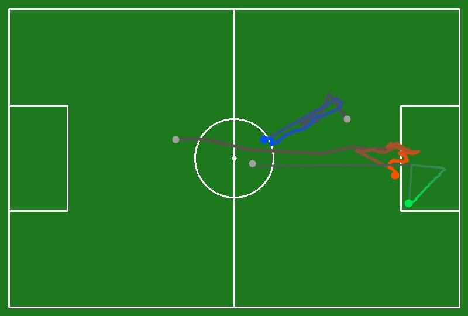
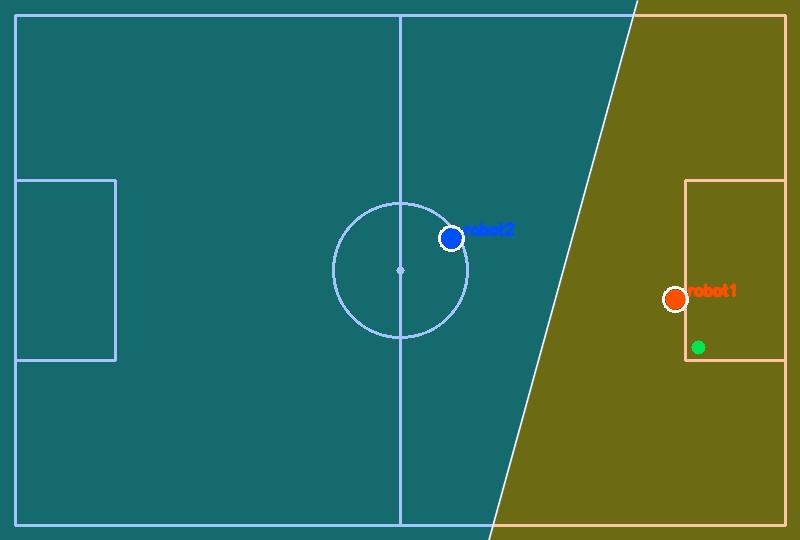

# Copa FutBotMX — Los Cuatro Frametásticos

<div align="center">

**Pipeline de visión por computadora para análisis automático de partidos de fútbol robótico.**  
Detecta robots y balón, construye trayectorias, identifica goles/tiros/pases y genera visualizaciones con estadísticas en tiempo real.

</div>

---

<div align="center">

### Análisis completo



*Frame original con detección YOLO+SAM3 (izq.) · Campo cenital con trayectorias y HUD de estadísticas en vivo (der.)*

</div>

---

<div align="center">

### Partidos analizados

| IMG_9866 | IMG_9868 | IMG_9869 |
|:---:|:---:|:---:|
|  |  |  |
| robot1 **70.6%** posesión · **2 goles** | Partido 2 | Partido 3 |

</div>

---

<div align="center">

### Segmentación y tracking — detalle

| Overlays SAM3 + YOLO sobre frame original |
|:---:|
|  |
| *Máscara pixel-level SAM3 (balón, cian) propagada automáticamente · Bounding boxes YOLO (robots) con Hungarian assignment anti-swap* |

| IMG_9868 | IMG_9869 |
|:---:|:---:|
|  |  |

</div>

---

## Tabla de contenidos

1. [Resumen del sistema](#1-resumen-del-sistema)
2. [Instalación y configuración](#2-instalación-y-configuración)
3. [Ejecución rápida](#3-ejecución-rápida)
4. [Pipeline paso a paso](#4-pipeline-paso-a-paso)
5. [Descripción de scripts](#5-descripción-de-scripts)
6. [Fórmulas y algoritmos](#6-fórmulas-y-algoritmos)
7. [Estructura de salidas](#7-estructura-de-salidas)
8. [Resultados sobre IMG_9866](#8-resultados-sobre-img_9866)
9. [Innovaciones técnicas](#9-innovaciones-técnicas)

---

## 1. Resumen del sistema

Pipeline de visión por computadora para analizar partidos de fútbol robótico grabados en video `.MOV`. Detecta robots y balón, construye trayectorias, califica equipos por color, detecta eventos de juego (goles, tiros, pases, colisiones) y genera visualizaciones interactivas.

```
Video .MOV
    │
    ▼ extract_frames.py        --step 3
Frames JPG (1 de cada 3 frames)
    │
    ▼ auto_corners.py          --frame ... --out ...
field_corners_<VIDEO>.json  (homografía cámara → campo)
    │
    ▼ pipeline.py              --auto
tracks/<VIDEO>_tracks.json  +  masks/<VIDEO>/  +  videos/<VIDEO>_tracked.mp4
    │
    ▼ analytics.py             --fps 30 --step 3
analytics/<VIDEO>_analytics.json
    │
    ▼ visualize.py             video | heatmap | topdown
videos/<VIDEO>_sidebyside.mp4  ·  viz/<VIDEO>/topdown_panel.png  ·  …
```

El script `run_pipeline.sh` orquesta las cinco etapas anteriores en una sola invocación.

### Arquitectura de detección y tracking

| Objeto | Detector | Tracker |
|--------|----------|---------|
| Robots | YOLOv8 fine-tuned (`runs/detect/train-2/weights/best.pt`) | Proximidad + zona de fusión + Hungarian assignment |
| Balón | SAM3 (Meta AI) VG por bounding box | Propagación automática SAM3 |
| Porterías | HSV (azul/amarillo) + mediana temporal | Detección estática por color |

### Panel de análisis completo



*Vista cenital del partido: heatmap de actividad, zonas de control Voronoi, trayectorias de los robots y estadísticas del juego.*

---

## 2. Instalación y configuración

### Requisitos

- Python 3.10 o superior
- GPU NVIDIA con CUDA 11.8+ (recomendado 8 GB VRAM)
- CUDA Toolkit instalado en el sistema ([guía oficial](https://developer.nvidia.com/cuda-downloads))

### Paso 1 — Clonar el repositorio

```bash
git clone <url-del-repo>
cd Copa_FutBotMX_los_cuatro_frametasticos
```

### Paso 2 — Crear y activar el entorno virtual

```bash
python3 -m venv .venv

# Linux / macOS / WSL2
source .venv/bin/activate

# Windows (PowerShell)
.venv\Scripts\Activate.ps1
```

### Paso 3 — Instalar PyTorch con CUDA

Elige el comando según tu versión de CUDA (ver [pytorch.org](https://pytorch.org/get-started/locally/)):

```bash
# CUDA 12.6
pip install torch torchvision --index-url https://download.pytorch.org/whl/cu126

# CUDA 11.8
pip install torch torchvision --index-url https://download.pytorch.org/whl/cu118
```

### Paso 4 — Instalar dependencias del proyecto

```bash
pip install -r requirements.txt
```

### Paso 5 — Instalar SAM3

SAM3 se incluye como subcarpeta del repositorio e instala en modo editable:

```bash
pip install -e sam3/
```

### Paso 6 — Verificar instalación

```bash
# CUDA disponible
python -c "import torch; print('CUDA:', torch.cuda.is_available(), '|', torch.cuda.get_device_name(0))"

# Dependencias del proyecto
python -c "import cv2, ultralytics, scipy, numpy, matplotlib; print('Dependencias OK')"

# SAM3
python -c "from sam3.model_builder import build_sam3_video_predictor; print('SAM3 OK')"
```

### Modelo YOLO (incluido en el repositorio)

El modelo YOLOv8 fine-tuned sobre robots Zumo y balón naranja se incluye en:

```
runs/detect/train-2/weights/best.pt
```

No requiere descarga adicional.

---

## 3. Ejecución rápida

`run_pipeline.sh` orquesta las cinco etapas del pipeline en una sola invocación. Detecta automáticamente robots y balón con YOLO y SAM3, calibra la homografía del campo, calcula analytics y genera el video side-by-side con HUD de estadísticas.

```bash
# Activar entorno virtual
source .venv/bin/activate

# Pipeline completo con detección automática
bash run_pipeline.sh --video /mnt/d/videos/IMG_9866.MOV --step 3 --fps 10
```

### Argumentos de run_pipeline.sh

| Argumento | Default | Descripción |
|-----------|---------|-------------|
| `--video <ruta>` | — | **Obligatorio.** Archivo de video de entrada (.MOV, .MP4, etc.) |
| `--step <n>` | `1` | Paso de extracción de frames. `--step 3` con video a 30 fps → 10 fps efectivos |
| `--fps <n>` | `10` | FPS del video de salida |
| `--ball_point <x,y>` | — | Coordenadas manuales del centroide del balón cuando YOLO no lo detecta en el frame 0 |
| `--ball_frame <n>` | `0` | Frame de inicialización del prompt SAM3 para el balón (usar con `--ball_point`) |
| `--tl/--tr/--br/--bl <x,y>` | — | Esquinas del campo en píxeles (top-left, top-right, bottom-right, bottom-left). Si se pasan los 4 puntos se omite la detección automática |
| `--skip_tracking` | `false` | Omite extracción + tracking y reutiliza el tracks JSON existente |
| `--skip_corners` | `false` | Reutiliza el JSON de esquinas si ya existe |
| `--skip_video` | `false` | Omite el render del video side-by-side |
| `--open` | `false` | Abre el video resultante con el explorador de Windows (WSL2) |
| `--python <ruta>` | `.venv/bin/python3` | Intérprete Python a usar |

### Ejemplos representativos

```bash
# Detección totalmente automática, step=3
bash run_pipeline.sh --video videos/IMG_9866.MOV --step 3

# Balón no visible en frame 0: inicializar SAM3 desde frame 5
bash run_pipeline.sh --video videos/IMG_9869.MOV --step 3 \
    --ball_point 1085,267 --ball_frame 5

# Esquinas del campo especificadas manualmente (cámara en ángulo severo)
bash run_pipeline.sh --video videos/IMG_9866.MOV --step 3 \
    --tl 90,0 --tr 1775,5 --br 1875,575 --bl 290,470

# Re-analizar sin re-ejecutar tracking (tracks ya calculados)
bash run_pipeline.sh --video videos/IMG_9866.MOV --step 3 --skip_tracking
```

### Salidas generadas

| Archivo | Descripción |
|---------|-------------|
| `output/tracks/<VIDEO>_tracks.json` | Centroides y bounding boxes por frame (YOLO/SAM3) |
| `output/analytics/<VIDEO>_analytics.json` | Posesión, velocidades, distancias, eventos, marcador |
| `output/field_corners_<VIDEO>.json` | Esquinas del campo para homografía perspectiva |
| `output/videos/<VIDEO>_sidebyside.mp4` | Video side-by-side con HUD de estadísticas en vivo |
| `output/debug/<VIDEO>_autodetect.jpg` | Detecciones YOLO en el frame 0 |
| `output/debug/<VIDEO>_corners_debug.jpg` | Visualización de la homografía detectada |

---

## 4. Pipeline paso a paso

### Etapa 1 — Extracción de frames

```bash
python scripts/extract_frames.py \
    --video /mnt/d/videos/IMG_9866.MOV \
    --step 3
# Salida: output/frames/IMG_9866/00000.jpg … 00101.jpg
```

`--step 3` extrae 1 de cada 3 frames → a 30 fps original = 10 fps efectivos.

### Etapa 2 — Detección de esquinas del campo (homografía)

```bash
python scripts/auto_corners.py \
    --frame  output/frames/IMG_9866/00000.jpg \
    --out    output/field_corners_IMG_9866.json \
    --debug  output/debug/IMG_9866_corners_debug.jpg
```

Si la detección automática falla (cámara en ángulo severo), se pueden especificar las esquinas manualmente con `--tl/--tr/--br/--bl`. También es posible generar una imagen con cuadrícula de coordenadas para identificarlas visualmente:

```bash
python scripts/auto_corners.py \
    --frame output/frames/IMG_9866/00000.jpg \
    --grid  output/grid_IMG_9866.jpg

python scripts/auto_corners.py \
    --frame output/frames/IMG_9866/00000.jpg \
    --tl 90,0 --tr 1775,5 --br 1875,575 --bl 290,470 \
    --out output/field_corners_IMG_9866.json
```



*Las líneas verdes definen el cuadrilátero del campo (homografía). Los puntos YELLOW y BLUE son los centroides de las porterías detectadas por mediana temporal HSV. La miniatura muestra la vista cenital resultante.*

### Etapa 3 — Segmentación y tracking (pipeline)

```bash
python scripts/pipeline.py \
    --frames_dir output/frames/IMG_9866 \
    --auto
# Salida:
#   output/tracks/IMG_9866_tracks.json
#   output/masks/IMG_9866/
#   output/videos/IMG_9866_tracked.mp4
```

El modo `--auto` detecta objetos automáticamente con YOLO en el primer frame. Si el balón no es visible en el frame 0, se puede inicializar SAM3 desde otro frame:

```bash
python scripts/pipeline.py \
    --frames_dir output/frames/IMG_9866 \
    --auto \
    --ball_point 1085,267 \
    --ball_frame 5
```

**Detección automática — frame 0:**


*YOLOv8 fine-tuned identifica robot1 (azul), robot2 (naranja) y el balón (amarillo) con sus centroides en píxeles.*

**Tracking en frame 3 (partido en curso):**



*SAM3 propaga la máscara del balón frame a frame; YOLO re-detecta robots con Hungarian assignment para evitar intercambio de identidades.*

### Etapa 4 — Analytics

```bash
python scripts/analytics.py \
    --tracks     output/tracks/IMG_9866_tracks.json \
    --frames_dir output/frames/IMG_9866 \
    --fps 30 --step 3
# Salida: output/analytics/IMG_9866_analytics.json
```

### Etapa 5 — Visualizaciones

```bash
# Video side-by-side: original | vista cenital animada
python scripts/visualize.py video \
    --tracks     output/tracks/IMG_9866_tracks.json \
    --analytics  output/analytics/IMG_9866_analytics.json \
    --frames_dir output/frames/IMG_9866 \
    --corners    output/field_corners_IMG_9866.json \
    --output     output/videos/ \
    --fps 10 --step 3

# Heatmaps de actividad
python scripts/visualize.py heatmap \
    --analytics output/analytics/IMG_9866_analytics.json \
    --bg        output/frames/IMG_9866/00000.jpg \
    --output    output/viz/IMG_9866/

# Panel cenital: heatmap + Voronoi + trails + estadísticas
python scripts/visualize.py topdown \
    --analytics output/analytics/IMG_9866_analytics.json \
    --corners   output/field_corners_IMG_9866.json \
    --output    output/viz/IMG_9866/
```

---

## 5. Descripción de scripts

| Script | Función |
|--------|---------|
| `run_pipeline.sh` | Orquestador Bash: ejecuta las 5 etapas del pipeline en una sola invocación |
| `extract_frames.py` | Extrae frames de video `.MOV` a JPEG con paso configurable (`--step`) |
| `pipeline.py` | Pipeline principal: YOLO (robots) + SAM3 (balón) → tracks JSON + máscaras + video |
| `auto_corners.py` | Detecta las 4 esquinas del campo (líneas blancas HSV + silueta verde + porterías) |
| `analytics.py` | Calcula posesión, velocidad, distancia y eventos (pase, colisión, gol, tiro a gol) |
| `visualize.py` | Heatmaps, Voronoi, trayectorias y video side-by-side con HUD de estadísticas |
| `auto_detect.py` | Detección YOLO en el frame 0 para inicialización automática del pipeline |
| `pick_points.py` | Herramienta interactiva para seleccionar prompts de punto (requiere GUI) |
| `pick_field_corners.py` | Herramienta interactiva para marcar esquinas del campo (requiere GUI) |
| `yolo_sam3_tracker.py` | Prototipo de integración YOLO → SAM3 en ensamble |

---

## 6. Fórmulas y algoritmos

### 6.1 Tracking de robots — Zona de fusión

Cuando los robots están separados (`d > MERGE_DIST = 160 px`):

```
velocidad_i(t) = regresión lineal OLS sobre historial de posiciones (12 frames)
prediccion_i(t) = posicion_i(t-1) + velocidad_i(t)
asignacion = argmin Hungarian( cost_matrix[i,j] = ||prediccion_i - deteccion_j|| )
```

Cuando los robots se juntan (`d < 160 px`, **zona de fusión**):

```
pre_snap = snapshot(posicion, velocidad) al entrar a la zona
prediccion_i(t) = pre_snap_i.posicion + pre_snap_i.velocidad × frames_en_zona
```

Este mecanismo preserva las identidades aunque los robots estén superpuestos.

### 6.2 Posesión

```
posesion(t) = argmin_robot { ||centroide_robot - centroide_balon|| }
    si esa distancia < POSSESSION_DIST_PX = 150 px
```

### 6.3 Velocidad y distancia

```
velocidad_i(t) [px/s] = ||centroide_i(t) - centroide_i(t-1)|| × fps_efectivos

fps_efectivos = fps_original / step = 30 / 3 = 10 fps

distancia_i = Σ_t ||centroide_i(t) - centroide_i(t-1)||
```

### 6.4 Detección de eventos

**Pase** — cambio de posesor con cooldown de 3 frames:
```
pase(t): posesion(t) ≠ posesion(t-1) AND posesion(t) ≠ None
```

**Colisión** — solape de bounding boxes:
```
IoU(box_robot1, box_robot2) > COLLISION_IOU_THRESH = 0.05
```

**Gol** — balón dentro de la máscara de la portería (o dentro de su bounding box
con margen de 80 px), con cooldown de 30 frames:
```
gol(t): centroide_balon ∈ mascara_porteria(color)
    OR  centroide_balon ∈ bbox_porteria(color) ± GOAL_BBOX_MARGIN
```

**Tiro a gol** — predicción de trayectoria antes de que el balón entre:
```
puntos = historial_balon[-SHOT_HISTORY:]   # últimos 6 frames
vx, vy = polyfit(t, x, 1)[0], polyfit(t, y, 1)[0]   # vel. por regresión lineal
speed = √(vx² + vy²) > SHOT_MIN_SPEED = 8 px/frame

Para k = 1..SHOT_LOOKAHEAD (18 frames):
    px(k) = pos_balon + vx·k
    py(k) = pos_balon + vy·k
    si (px, py) ∈ bbox_porteria ± SHOT_MARGIN → TIRO detectado
```

### 6.5 Detección de porterías — Mediana temporal HSV

```
Para N_MEDIAN = 20 frames muestreados uniformemente:
    mascara_color(frame) = HSV_inRange(frame, LO, HI)

mascara_estable = pixel_mediana_temporal(mascaras)
    # Solo píxeles estacionarios sobreviven la mediana → elimina robots/personas en movimiento
```

Rangos HSV:

| Color | H | S | V |
|-------|---|---|---|
| Amarillo | 15–38 | >100 | >100 |
| Azul | 95–130 | >100 | >40 |

### 6.6 Homografía para vista cenital

Se calculan 4 correspondencias campo→canvas:

```
src (píxeles cámara):  [TL, TR, BR, BL]
dst (canvas 800×540):  [(0,0), (800,0), (800,540), (0,540)]

H = findHomography(src, dst)

punto_canvas = perspectiveTransform(punto_camara, H)
```

Para el video IMG_9866 (cámara a 45°, borde superior fuera de frame):
```
TL = (90, 0)    TR = (1775, 5)
BR = (1875, 575) BL = (290, 470)
```

---

## 7. Estructura de salidas

```
output/
├── frames/
│   └── <video>/          # Frames extraídos (JPEG, no versionar en git)
│       ├── 00000.jpg
│       └── …
├── masks/
│   └── <video>/          # Máscaras binarias SAM3 por objeto
│       ├── 00000_obj3.png  # obj3 = balón
│       └── …
├── tracks/
│   └── <video>_tracks.json   # Centroides + boxes por frame
├── analytics/
│   └── <video>_analytics.json  # Posesión, velocidad, eventos
├── videos/
│   ├── <video>_tracked.mp4      # Video con overlays SAM3/YOLO
│   └── <video>_sidebyside.mp4   # Video side-by-side con vista cenital
├── gif/
│   ├── <video>_sidebyside.gif   # GIF del video side-by-side (640 px)
│   └── <video>_tracked.gif      # GIF con overlays SAM3/YOLO (640 px)
├── viz/
│   └── <video>/
│       ├── heatmap_robot1.jpg
│       ├── heatmap_robot2.jpg
│       ├── heatmap_ball.jpg
│       ├── heatmap_combined.jpg
│       ├── heatmap_panel.png
│       ├── topdown_heatmap.jpg
│       ├── topdown_trails.jpg
│       ├── topdown_voronoi.jpg
│       └── topdown_panel.png
├── debug/
│   ├── <video>_autodetect.jpg   # Detecciones YOLO frame 0
│   └── <video>_corners_debug.jpg
└── field_corners_<video>.json   # Esquinas del campo (homografía)
```

### Formato de `_tracks.json`

```json
{
  "0": {
    "robot1": {
      "label": "robot1",
      "score": 0.93,
      "source": "yolo",
      "centroid": [849, 295],
      "box_xyxy": [789, 199, 909, 392]
    },
    "ball": {
      "label": "ball",
      "score": 0.95,
      "source": "sam3",
      "centroid": [1084, 267],
      "box_xyxy": null
    }
  }
}
```

### Formato de `_analytics.json`

```json
{
  "frames": {
    "0": { "possessor": "robot2", "ball_pos": [1084,267], "velocities": {…}, "events": [] }
  },
  "summary": {
    "total_frames": 102,
    "possession": { "robot1": {"frames":72,"pct":70.6}, … },
    "speed_avg_px_s": { "robot1": 102.8, "robot2": 65.5, "ball": 25.9 },
    "distance_px":    { "robot1": 1048.7, "robot2": 667.8, "ball": 263.9 },
    "score": { "robot1": 2, "robot2": 0 }
  },
  "events": [ … ],
  "paths": { "robot1": [[cx,cy],…], "robot2": […], "ball": […] }
}
```

---

## 8. Resultados sobre IMG_9866

Video de prueba: `IMG_9866.MOV` (102 frames extraídos, step=3 → 10 fps efectivos ≈ 10.2 s)

### Métricas cuantitativas

| Métrica | Robot 1 | Robot 2 | Balón |
|---------|---------|---------|-------|
| Posesión | **70.6%** (72 frames) | 2.0% (2 frames) | — |
| Velocidad prom | **102.8 px/s** | 65.5 px/s | 25.9 px/s |
| Distancia total | **1048.7 px** | 667.8 px | 263.9 px |
| Goles marcados | **2** | 0 | — |

### Eventos detectados

| Tiempo | Evento | Detalle |
|--------|--------|---------|
| 0.6 s | Pase | robot2 → robot1 |
| 1.0 s | Colisión | robot1 + robot2 (IoU = 0.08) |
| 1.6 s | Tiro a gol | portería amarilla/derecha (~1 frame antes) |
| 1.7 s | **GOL** | robot1 · portería derecha (amarilla) · 1–0 |
| 4.7 s | Tiro a gol | portería amarilla/derecha (~1 frame antes) |
| 5.1 s | **GOL** | robot1 · portería derecha (amarilla) · 2–0 |

### Análisis cenital completo


### Heatmaps de actividad (vista cámara)



*Arriba: robot1 (70.6% posesión, 102.8 px/s) y robot2 (2.0% posesión, 65.5 px/s). Abajo: balón y mapa combinado. El color cálido indica mayor tiempo de permanencia.*

### Trayectorias (vista cenital)

| Trayectorias | Zonas de control |
|:---:|:---:|
|  |  |
| *Trails: robot1 (naranja), robot2 (azul), balón (gris). Ambos robots atacan hacia la portería derecha.* | *Voronoi: robot1 controla el lado derecho (oliva), robot2 el lado izquierdo (teal).* |

### Archivos generados

| Archivo | Descripción |
|---------|-------------|
| `output/tracks/IMG_9866_tracks.json` | Centroides de robot1, robot2, balón por frame |
| `output/analytics/IMG_9866_analytics.json` | Estadísticas completas del partido |
| `output/videos/IMG_9866_tracked.mp4` | Video con overlays de segmentación |
| `output/videos/IMG_9866_sidebyside.mp4` | Video side-by-side con vista cenital animada |
| `output/viz/IMG_9866/topdown_panel.png` | Panel heatmap + Voronoi + trails + stats |
| `output/viz/IMG_9866/heatmap_panel.png` | Heatmaps de actividad individual y combinado |
| `output/field_corners_IMG_9866.json` | Esquinas del campo para homografía |

---

## 9. Innovaciones técnicas

### 9.1 Ensamble YOLO + SAM3

Combinación de dos modelos complementarios:

- **YOLO** (`runs/detect/train-2/weights/best.pt` entrenado en robots): detección rápida cada frame → bounding boxes
- **SAM3** (Meta AI): segmentación semántica de alta calidad → máscara precisa del balón

YOLO identifica a los robots aunque sean visualmente idénticos gracias al tracking por proximidad.  
SAM3 produce máscaras pixel-level del balón propagadas automáticamente a todo el video.


*YOLOv8 fine-tuned sobre ~48 imágenes anotadas de robots Zumo + balón naranja. Conf threshold = 0.25. Fallback HSV si YOLO no encuentra el balón.*

### 9.2 Tracking anti-swap con zona de fusión

Problema: cuando dos robots se tocan, los trackers simples intercambian las etiquetas.

Solución implementada:
1. **Regresión lineal** sobre historial de 12 frames para estimar velocidad
2. **Snapshot pre-fusión**: al detectar que los robots están a < 160 px, se guarda posición+velocidad antes del contacto
3. **Extrapolación durante el contacto**: las predicciones se calculan desde el snapshot, no desde la posición observada
4. **Hungarian assignment global** (scipy): asignación óptima detección↔label en cada frame

### 9.3 Predicción de tiro a gol

El sistema detecta tiros **antes** de que el balón entre a la portería:

1. Ajusta regresión lineal sobre los últimos 6 centroides del balón
2. Extrapola la trayectoria hasta 18 frames adelante
3. Si la trayectoria intersecta el bounding box de una portería (± 100 px), dispara evento `shot_on_goal`

Esto permite actuar cuando SAM3 pierde el balón al entrar a la portería.

### 9.4 Detección de porterías por mediana temporal

Las porterías son amarilla y azul, pero en el campo hay otros objetos de esos colores (robots con pequeños LEDs, ropa de personas, etc.).

Filtro de mediana temporal:
- Solo los píxeles que **permanecen estáticos** en la mayoría de los frames sobreviven
- Elimina robots en movimiento, personas, reflejos dinámicos
- Las porterías (fijas) generan máscaras estables

### 9.5 Vista cenital con homografía perspectiva

La cámara no está en posición cenital; tiene un ángulo de ~45°. Para corregirlo:

1. Se identifican las 4 esquinas del campo en coordenadas de imagen
2. Se calcula la matriz de homografía H con `cv2.findHomography`
3. Cada centroide se proyecta: `punto_campo = H × punto_camara`

Esto produce una vista top-down donde las posiciones son métricamente correctas aunque la cámara esté inclinada.


*Las líneas verdes delimitan el campo. La miniatura en la esquina superior izquierda muestra la vista cenital resultante tras la homografía.*

---

## Licencia

Este proyecto se distribuye bajo la licencia [MIT](LICENSE).

